<div align="center">

# 🛡️ ClawTower

**OS-level runtime security for AI agents — any agent, any framework**

[](https://github.com/ClawTower/ClawTower/actions)
[](LICENSE)
[](https://github.com/ClawTower/ClawTower/releases)

</div>

---

AI agents now run shell commands, edit files, call APIs, and sometimes use `sudo` on real infrastructure. Once they're executing, visibility drops fast — prompt guardrails and container boundaries don't tell you what's actually happening at the OS level.

ClawTower monitors at the kernel boundary (auditd, inotify, network policy) and is designed so the agent being watched **can't turn it off**. The binary is immutable (`chattr +i`), the admin key is Argon2-hashed and never stored, and every tamper attempt is logged and alerted on. This is the **"swallowed key" pattern**: the thing being watched can't fire the security guard.

> **Early-stage project.** ClawTower works and is battle-tested against its own adversarial pentest suite, but it hasn't been widely deployed yet. Expect rough edges. [Testers and contributors welcome.](CONTRIBUTING.md)

## Quick Start

### One-line Install

```bash
curl -sSL https://raw.githubusercontent.com/ClawTower/ClawTower/main/scripts/oneshot-install.sh | sudo bash
```

### Build from Source

```bash
git clone https://github.com/ClawTower/ClawTower.git
cd ClawTower
cargo build --release

# Install binaries
sudo install -m 755 target/release/clawtower /usr/local/bin/clawtower
sudo install -m 755 target/release/clawsudo /usr/local/bin/clawsudo

# Make immutable (the "swallowed key")
sudo chattr +i /usr/local/bin/clawtower
```

### Initial Setup

```bash
# 1. Create config directory and copy config
sudo mkdir -p /etc/clawtower
sudo cp config.toml /etc/clawtower/config.toml

# Customize via drop-in overrides (survives updates)
sudo mkdir -p /etc/clawtower/config.d
sudo nano /etc/clawtower/config.d/my-overrides.toml    # watched_users, slack webhook, etc.

# 2. Run the setup script (installs binary, creates dirs, sets up systemd)
sudo scripts/setup.sh

# 3. Admin key is auto-generated on first run — save it!
#    It is displayed ONCE in journalctl output and stored only as an Argon2 hash
#    Lost your key? See docs/KEY-RESET.md (with root) or docs/RECOVERY.md (without)
```

> **Note:** Don't edit `config.toml` directly — it gets replaced on updates. Put your customizations in `/etc/clawtower/config.d/*.toml` drop-in files instead.

**Recommended hardening** (run after setup):

```bash
sudo scripts/setup-auditd.sh        # Syscall monitoring — highly recommended
sudo scripts/setup-sudoers-deny.sh  # Block agent from stopping ClawTower
sudo scripts/setup-slack.sh         # Slack alerts
```

**Optional integrations** (add as needed):

```bash
sudo scripts/setup-iptables.sh      # Network alert logging
sudo scripts/setup-apparmor.sh      # AppArmor confinement
sudo scripts/build-preload.sh       # Build LD_PRELOAD guard library
sudo scripts/enable-preload.sh      # Activate LD_PRELOAD guard
sudo scripts/setup-falco.sh         # Falco eBPF monitoring
sudo scripts/setup-samhain.sh       # Samhain file integrity
```

> 📖 **Full installation guide:** See [`.docs/INSTALL.md`](.docs/INSTALL.md) for prerequisites, hardening details, and recovery procedures.

### Available Scripts

| Script | Purpose |
|--------|---------|
| `scripts/setup.sh` | Full installation (binary, dirs, systemd service) |
| `scripts/install.sh` | Apply tamper-proof hardening (chattr +i, sudoers deny) |
| `scripts/configure.sh` | Interactive config wizard |
| `scripts/uninstall.sh` | Reverse hardening + remove (requires admin key) |
| `scripts/setup-auditd.sh` | Install auditd rules |
| `scripts/setup-audit-rules.sh` | Configure specific audit watch rules |
| `scripts/setup-iptables.sh` | Configure iptables logging |
| `scripts/setup-apparmor.sh` | Load AppArmor profiles |
| `scripts/setup-falco.sh` | Install/configure Falco |
| `scripts/setup-samhain.sh` | Install/configure Samhain |
| `scripts/setup-slack.sh` | Configure Slack webhooks |
| `scripts/setup-sudoers-deny.sh` | Sudoers deny rules for agent |
| `scripts/build-preload.sh` | Compile libclawtower.so |
| `scripts/enable-preload.sh` | Activate LD_PRELOAD guard |
| `scripts/sync-barnacle.sh` | Update BarnacleDefense pattern databases |
| `scripts/oneshot-install.sh` | Single-command install from GitHub |

---

## Agent-Agnostic

ClawTower works at the OS level — it doesn't hook into your agent's code or require SDK integration. If an agent runs on Linux under a user account, ClawTower can monitor that UID:

- OpenClaw, Nanobot, SuperAGI, Goose, memU
- Claude Code, Codex CLI, Aider, Continue
- Devin, SWE-agent, and other autonomous coding agents
- Custom agents built on LangChain, CrewAI, AutoGen, or raw API calls
- Any process running under a monitored user account

Point it at the UID your agent runs as and it starts watching.

## Where ClawTower Fits

ClawTower is **not** a replacement for container isolation. It's the other half of the stack.

If tools like NanoClaw are your prevention layer (sandbox the agent so it can't cause damage), ClawTower is your detection-and-forensics layer (watch what the agent actually does, alert, and provide a tamper-evident trail). **Contain what you can, monitor what you must.** You want both.

ClawTower operates at the runtime layer — the part that catches what static scanning and sandboxing can't:

- A skill passes VirusTotal but exfiltrates data through allowed network paths at runtime
- An agent's behavior changes after a context window is poisoned
- A legitimate tool (`curl`, `scp`) is used for unauthorized data transfer
- Someone tampers with the agent's identity or configuration files

## What It Monitors

- **Behavioral detection** — syscall-level classification of exfiltration, privilege escalation, persistence, reconnaissance, side-channel attacks, and container escapes via auditd. Distinguishes agent vs. human actors.
- **File integrity** — inotify-based sentinel with protected (quarantine + restore) and watched (diff + alert) policies. Content scanning on every change.
- **Cognitive file protection** — SHA-256 baselines for AI identity files (`SOUL.md`, `AGENTS.md`, etc.). Any modification is a CRITICAL alert.
- **Pattern engine** — regex databases for prompt injection, dangerous commands, privacy violations, and supply-chain IOCs. Compiled at startup, applied in real-time.
- **30+ security scanners** — periodic checks covering firewall, auditd config, SSH hardening, Docker, SUID binaries, open ports, crontabs, and more.
- **Hash-chained audit trail** — SHA-256 chain where each entry includes the previous hash. Retroactive edits are mathematically detectable.
- **`clawsudo`** — sudo proxy/gatekeeper. Every privileged command goes through YAML policy evaluation first. Denied = exit code 77 + alert.
- **Network policy** — allowlist/blocklist for outbound connections. Scans commands for embedded URLs.
- **API key vault proxy** — maps virtual keys to real ones so the agent never sees actual credentials. Built-in DLP scanning.
- **Terminal dashboard** — Ratatui TUI with tabbed views for alerts, network, FIM, system status, and config editing.
- **Slack alerts** — webhook notifications with severity filtering, backup webhook failover, and periodic heartbeats.
- **Auto-updater** — Ed25519-verified binary updates with the `chattr -i` → replace → `chattr +i` dance.
- **Log tamper detection** — monitors audit logs for truncation, deletion, and inode replacement.
- **Admin key system** — Argon2-hashed, generated once, never stored. Rate limited. Unix socket for authenticated runtime commands.

## Configuration

ClawTower uses a TOML config file (default: `/etc/clawtower/config.toml`). Key sections:

```toml
[general]
watched_users = ["1000"]        # Numeric UIDs to monitor (not usernames! find with: id -u <agent-user>)
min_alert_level = "info"        # info | warning | critical
log_file = "/var/log/clawtower/clawtower.log"

[slack]
webhook_url = "https://hooks.slack.com/services/..."
backup_webhook_url = ""         # Failover webhook
channel = "#security"
min_slack_level = "warning"     # Only send warnings+ to Slack
heartbeat_interval = 3600       # Health ping every hour (0 = off)

[auditd]
enabled = true
log_path = "/var/log/audit/audit.log"

[network]
enabled = true
source = "auto"                 # auto | journald | file
log_prefix = "CLAWTOWER_NET"
allowlisted_cidrs = ["192.168.0.0/16", "10.0.0.0/8"]

[sentinel]
enabled = true
quarantine_dir = "/etc/clawtower/quarantine"
shadow_dir = "/etc/clawtower/sentinel-shadow"
scan_content = true
debounce_ms = 200

[[sentinel.watch_paths]]
path = "/home/agent/.workspace/SOUL.md"
patterns = ["*"]
policy = "protected"            # protected = restore + alert; watched = diff + alert

[barnacle]
enabled = false
vendor_dir = "./vendor/barnacle/barnacle/skill/configs"

[scans]
interval = 300                  # Seconds between scan sweeps

[auto_update]
enabled = true
interval = 300                  # Check GitHub every 5 minutes

[proxy]
enabled = false
bind = "127.0.0.1"
port = 18790

[api]
enabled = false
bind = "0.0.0.0"
port = 18791

[policy]
enabled = true
dir = "./policies"              # YAML policy rules for clawsudo

[netpolicy]
enabled = false
mode = "blocklist"              # allowlist | blocklist
blocked_hosts = ["evil.com"]

[ssh]
enabled = true                  # Monitor SSH login events via journald
```

> 📖 **Full configuration reference:** See [`.docs/CONFIGURATION.md`](.docs/CONFIGURATION.md) for every field, type, default value, and TOML example.

## Usage

```bash
# Start with Terminal UI (default)
clawtower

# Run headless (servers, background monitoring)
clawtower run --headless

# One-shot security scan and exit
clawtower scan

# Show service status
clawtower status

# Interactive configuration wizard
clawtower configure

# Self-update to latest release
clawtower update

# Check for updates without installing
clawtower update --check

# Verify audit chain integrity
clawtower verify-audit

# Update BarnacleDefense pattern databases
clawtower sync

# Apply tamper-proof hardening
clawtower harden

# Tail service logs
clawtower logs

# Uninstall (requires admin key)
clawtower uninstall

# Admin key is auto-generated on first run and printed once — save it!
# It is stored only as an Argon2 hash at /etc/clawtower/admin.key.hash
# Lost it? See docs/KEY-RESET.md or docs/RECOVERY.md

# Use clawsudo instead of sudo for AI agents
clawsudo apt-get update
```

## Architecture Overview

ClawTower uses a **three-ring defense model**: enforcement at the boundary, real-time detection in the middle, and periodic auditing as the outer sweep. Everything feeds into a single event pipeline that deduplicates, correlates, and routes alerts to humans.

```mermaid
graph TD
    AGENT["AI Agent (watched UID)"]
    HUMAN["Human Admin (CLI · TUI · Slack)"]

    subgraph R1["Ring 1 — Enforcement"]
        direction TB
        CLAWSUDO["clawsudo — sudo gatekeeper<br/>YAML policies · allow / deny / ask"]
        PROXY["API proxy + prompt firewall<br/>DLP · key vault · 7 threat categories"]
    end

    AGENT -->|"sudo"| CLAWSUDO
    AGENT -->|"API / LLM"| PROXY
    AGENT -->|"syscalls / files / net"| KERNEL["OS Kernel<br/>auditd · inotify · iptables"]

    subgraph R2["Ring 2 — Real-Time Detection"]
        direction TB
        SYSCALL["Syscall analysis<br/>behavior (270 rules) · barnacle (4 DBs)<br/>policy · capability envelope"]
        FIM["File integrity<br/>sentinel · cognitive baselines<br/>memory sentinel · Falco · Samhain"]
        NET["Network + auth<br/>iptables parser · host policy<br/>SSH monitor · log tamper"]
    end

    KERNEL --> R2

    subgraph R3["Ring 3 — Periodic Audit"]
        SCAN["33 security scanners<br/>firewall · SSH · SUID · docker<br/>crontab · packages · persistence"]
    end

    R1 -->|"deny alerts"| RAW
    R2 -->|"alerts"| RAW
    R3 -->|"results"| RAW

    subgraph PIPE["Event Pipeline"]
        direction TB
        RAW["raw_tx (mpsc, cap 1000)"]
        AGG["Aggregator — fuzzy dedup · rate limit"]
        CORR["Correlator — cross-layer scoring<br/>300 → 600 → 900 thresholds"]
        RESP["Response Engine<br/>Gate (block + ask) · Reactive (contain)"]
        RAW --> AGG --> CORR --> RESP
    end

    HUMAN -->|"approve / deny"| RESP

    subgraph OUT["Where Alerts Go"]
        direction TB
        DISPLAY["TUI dashboard (6 tabs) · Slack alerts"]
        RECORD["REST API · audit chain (HMAC SHA-256)"]
        EXPORT["SIEM export — CEF · webhook · JSONL"]
    end

    AGG --> OUT
    RESP -->|"approved"| CONTAIN["Containment<br/>kill · suspend · drop net<br/>revoke keys · freeze FS · lock clawsudo"]
    RESP -->|"Critical"| HUMAN

    TAMPER["Tamper Protection<br/>chattr +i · Argon2 admin key · lockfiles"]
    TAMPER -.->|"protects"| R1
    TAMPER -.->|"protects"| RECORD
```



**Three rings, one pipeline.** Ring 1 (clawsudo + proxy) blocks dangerous actions *before* they execute. Ring 2 (auditd, sentinel, network, memory) catches threats *as they happen*. Ring 3 (33 scanners) sweeps for drift and misconfigurations on a timer. All three rings feed alerts into the same `raw_tx` channel, where the aggregator deduplicates and rate-limits, the correlator scores cross-layer patterns, and the response engine decides whether to block (Gate) or contain (Reactive) — with human approval required for Critical actions.

**Tamper protection** wraps the whole system: immutable binaries, an admin key that's never stored, and cross-process lockfiles that propagate containment even to standalone binaries like clawsudo.

### Detailed Architecture Diagram

```mermaid
graph TD
    AGENT["AI Agent<br/>shell · sudo · API · files · LLM · net"]
    ADMIN["Human Admin<br/>CLI · TUI · config · Slack"]

    subgraph R1["Ring 1 — Enforcement"]
        direction TB
        CLAWSUDO["clawsudo — sudo gatekeeper<br/>YAML policy · GTFOBins detect · deny-first"]
        PROXY["API proxy + prompt firewall<br/>DLP · key vault · 7 threat categories"]
    end

    AGENT -->|"sudo"| CLAWSUDO
    AGENT -->|"API / LLM"| PROXY
    AGENT -->|"syscalls / files / net"| OS

    subgraph OS["OS Kernel Layer"]
        direction TB
        OS_SYS["auditd — SYSCALL / EXECVE / AVC"]
        OS_FS["inotify — file events"]
        OS_NET["iptables · journald — network · SSH"]
        OS_EXT["Falco eBPF · Samhain · /proc memory"]
    end

    subgraph R2["Ring 2 — Real-Time Detection"]
        direction TB
        SYSCALL["Syscall Analysis<br/>behavior (270 rules · 7 categories)<br/>barnacle (4 pattern DBs)<br/>YAML policy · capability envelope"]
        FILES["File Integrity<br/>sentinel (quarantine + restore)<br/>cognitive baselines · memory sentinel"]
        NETAUTH["Network + Auth<br/>iptables parser · host policy<br/>SSH monitor · log tamper · UFW diffs"]
    end

    OS_SYS --> SYSCALL
    OS_FS --> FILES
    OS_NET --> NETAUTH
    OS_EXT --> FILES

    subgraph R3["Ring 3 — Periodic Audit"]
        SCAN["33 scanners — firewall · SSH · SUID<br/>docker · crontab · persistence<br/>packages · kernel · accounts"]
    end

    R1 -->|"deny alerts"| RAW
    R2 -->|"alerts"| RAW
    R3 -->|"results"| RAW

    subgraph PIPE["Processing Pipeline"]
        direction TB
        RAW["raw_tx (mpsc, cap 1000)"]
        AGG["Aggregator<br/>fuzzy dedup · rate limit"]
        CORR["Correlator<br/>cross-layer scoring · 300→600→900"]
        RESP["Response Engine<br/>Gate (block + ask) · Reactive (contain)"]
        RAW --> AGG --> CORR --> RESP
    end

    ADMIN -->|"approve / deny"| RESP

    subgraph OUT["Outputs"]
        direction TB
        DISPLAY["TUI dashboard (6 tabs) · Slack alerts"]
        RECORD["REST API · audit chain (HMAC SHA-256)"]
        EXPORT["SIEM export — CEF · webhook · JSONL"]
    end

    AGG --> OUT

    subgraph CONTAIN["Containment"]
        ACTIONS["kill · suspend · drop network<br/>revoke keys · freeze FS · lock clawsudo"]
    end

    RESP -->|"approved"| CONTAIN
    RESP -->|"Critical"| ADMIN

    TAMPER["Tamper Protection<br/>chattr +i · Argon2 admin key · AppArmor"]
    TAMPER -.->|"protects"| R1
    TAMPER -.->|"protects"| RECORD
```



### Exhaustive Input Sources

#### OS-Level Syscall Monitoring

| Source | Module | Trigger | What It Detects |
|--------|--------|---------|----------------|
| Auditd log tail | `auditd.rs` | SYSCALL/EXECVE/AVC records in `/var/log/audit/audit.log` | Every command the watched user (by UID) executes |
| Behavior engine | `behavior.rs` | Parsed auditd events | ~270 patterns across 7 categories: DATA_EXFIL, PRIV_ESC, SEC_TAMPER, RECON, SIDE_CHAN, FIN_THEFT, SOCIAL_ENG |
| Barnacle engine | `barnacle.rs` | Parsed auditd events + sentinel file content | 4 JSON databases: injection patterns, dangerous commands, privacy rules, supply-chain IOCs |
| Policy engine | `policy.rs` | Parsed auditd events | User-configurable YAML rules (detection-only, not enforcement) |
| Network policy | `netpolicy.rs` | URLs extracted from commands | Allowlist/blocklist mode for outbound connections (hosts + ports) |
| Capability envelope | `agent_envelope.rs` | Parsed commands | "Known good" allowlist: flags anything OUTSIDE the agent's declared capabilities (binaries, hosts, write paths, containers, sudo, package installs) |

#### Network Monitoring

| Source | Module | Trigger | What It Detects |
|--------|--------|---------|----------------|
| iptables log parser | `network.rs` | Log lines matching configurable `log_prefix` | Blocked/allowed network connections (IPs, ports, CIDR) |
| journald network | `journald.rs` | Kernel messages with iptables prefix | Same as above, auto-detected journal vs file source |
| Firewall state | `firewall.rs` | Periodic `ufw status` polling | UFW rule changes (diff-based detection) |

#### File Integrity

| Source | Module | Trigger | What It Detects |
|--------|--------|---------|----------------|
| Real-time sentinel | `sentinel.rs` | inotify events on watched paths | File modifications; Protected = quarantine + restore + CRIT alert; Watched = shadow update + INFO diff |
| Cognitive baselines | `cognitive.rs` | SHA-256 hash comparison | Identity file tampering (SOUL.md, IDENTITY.md protected; MEMORY.md watched) |
| Falco parser | `falco.rs` | JSON events from Falco eBPF | Syscall-level violations (container escapes, privilege changes) |
| Samhain parser | `samhain.rs` | Samhain FIM log events | Host-based file integrity changes |
| Memory sentinel | `memory_sentinel.rs` | Periodic process memory scans | Memory integrity violations, cross-memory corruption, hardware watchpoints |

#### Authentication and Access

| Source | Module | Trigger | What It Detects |
|--------|--------|---------|----------------|
| SSH monitor | `journald.rs` | journalctl sshd events | Login attempts (success/fail), brute force |
| Log tamper monitor | `logtamper.rs` | Periodic audit log stat checks | Log truncation, deletion, inode replacement, permission changes |

#### API Proxy and Prompt Firewall

| Source | Module | Trigger | What It Detects |
|--------|--------|---------|----------------|
| DLP scanner | `proxy.rs` | Outbound API request bodies | SSN, credit card numbers, AWS keys (block or redact) |
| Prompt firewall | `prompt_firewall.rs` | Outbound LLM request bodies | 7 threat categories: prompt injection, exfil-via-prompt, jailbreak, tool abuse, system prompt extraction, social engineering, indirect injection |
| Key vault | `proxy.rs` | API requests with virtual keys | Virtual-to-real key mapping; TTL expiry, path restrictions, risk-score auto-revoke |

#### Command Interception (clawsudo)

| Source | Module | Trigger | What It Detects |
|--------|--------|---------|----------------|
| Sudo gatekeeper | `bin/clawsudo.rs` | Agent runs `clawsudo <cmd>` instead of `sudo` | YAML policy evaluation with 5-step cascade: response engine lock check, policy loading (fail-secure), GTFOBins shell escape detection (30+ patterns), policy eval (first match wins), allow/deny/ask outcome |

#### Periodic Security Scanners (33 scans)

| Scanner | What It Checks |
|---------|---------------|
| `scan_firewall` | UFW/iptables rules active |
| `scan_auditd` | Audit daemon running + rules loaded |
| `scan_integrity` | FIM tools installed |
| `scan_updates` | Pending security updates |
| `scan_ssh` | SSH hardening (PermitRootLogin, etc.) |
| `scan_listening_services` | Open ports |
| `scan_crontab_audit` | Suspicious cron jobs |
| `scan_world_writable_files` | Insecure file permissions |
| `scan_suid_sgid_binaries` | SUID/SGID binary audit |
| `scan_kernel_modules` | Unusual loaded modules |
| `scan_docker_security` | Docker daemon security |
| `scan_password_policy` | PAM password rules |
| `scan_open_file_descriptors` | FD exhaustion risk |
| `scan_dns_resolver` | DNS resolver config |
| `scan_ntp_sync` | Time synchronization |
| `scan_failed_login_attempts` | Recent auth failures |
| `scan_zombie_processes` | Zombie process accumulation |
| `scan_swap_tmpfs_security` | Swap/tmpfs mount flags |
| `scan_environment_variables` | Dangerous env vars (LD_PRELOAD, etc.) |
| `scan_ld_preload_persistence` | LD_PRELOAD injection vectors |
| `scan_package_integrity` | dpkg verification |
| `scan_core_dump_settings` | Core dump security |
| `scan_network_interfaces` | Promisc mode, bridges |
| `scan_systemd_hardening` | Service hardening flags |
| `scan_user_account_audit` | UID 0 accounts, no-password |
| `scan_sidechannel_mitigations` | Spectre/Meltdown mitigations |
| `scan_shadow_quarantine_permissions` | Sentinel dirs permissions |
| `scan_user_persistence` | Crontabs, systemd timers, .bashrc mods, authorized_keys, at jobs |
| `scan_immutable_flags` | chattr +i on ClawTower files |
| `scan_apparmor_protection` | AppArmor profiles loaded |
| `scan_barnacle_sync` | Pattern DB freshness |
| `scan_sudoers_risk` | Risky sudoers entries |

### Processing Pipeline

| Layer | Module | What It Does |
|-------|--------|-------------|
| Aggregator | `aggregator.rs` | Fuzzy dedup (digits to `#`, 30s window, 5s for Critical, 1h for scans), rate limiting (20/source/60s, Critical bypasses), incident mode support |
| Correlator | `correlator.rs` | Cross-layer event correlation (LD_PRELOAD, eBPF, seccomp, memory sentinel, process cage), decaying threat score (50 pts/sec), thresholds at 300/600/900 |
| Response Engine | `response.rs` | Two modes: Gate (action held, agent blocks) and Reactive (post-detection containment). Playbook evaluation, human approval via Slack/TUI/API, auto-deny on 2min timeout. Containment: KillProcess, SuspendProcess, DropNetwork, RevokeApiKeys, FreezeFilesystem, LockClawsudo |
| Config Layering | `config.rs` + `config_merge.rs` | Base `config.toml` + `config.d/*.toml` overlays + optional `--profile=`. Scalar replace, list `_add`/`_remove` semantics |

### Output Destinations

| Destination | Module | What Gets Sent |
|-------------|--------|---------------|
| TUI dashboard | `tui.rs` | 6 tabs: Alerts, Network, Falco, FIM, System, Config editor |
| Slack webhook | `slack.rs` | Alerts above `min_slack_level` + startup message + heartbeat |
| HTTP API | `api.rs` | `/api/status`, `/api/alerts`, `/api/security`, `/api/health`, `/api/evidence` |
| Audit chain | `audit_chain.rs` | HMAC SHA-256 hash-linked JSONL (tamper-evident) |
| SIEM export | `export.rs` | Syslog CEF, JSON webhook, rotated JSONL file |
| stderr | `orchestrator.rs` | All alerts to stderr when running headless |

### Human vs Agent Input Paths

**Human admin interacts via:**
- CLI (`clawtower <subcommand>`) — 20+ management commands
- TUI dashboard (keyboard-driven, 6 tabs + config editor)
- Admin socket (Argon2 key-authenticated Unix socket)
- REST API (Bearer token auth, approval/deny endpoints)
- Slack (approve/deny response engine actions)
- Config files (TOML base + overlays + profiles)

**AI agent actions are detected via:**
- Auditd syscall monitoring (every EXECVE by watched UID, actor attribution via `auid`)
- clawsudo interception (5-step cascade: lock check, fail-secure, GTFOBins, policy eval, allow/deny/ask)
- Sentinel file watching (inotify on 30+ paths, quarantine + restore for protected files)
- Proxy DLP scanning (SSN/credit card/AWS key detection in API request bodies)
- Prompt firewall (137+ regex patterns across 7 threat categories, 3-tier enforcement)
- Network policy (URL extraction from commands, host allowlist/blocklist)
- Capability envelope (positive security model: flag anything outside declared "known good")
- Memory sentinel (process memory integrity baselines via BLAKE3 hashing)

## Contributing

This is an early-stage project and contributions make a real difference right now — detection rules, scanners, integration guides, bug reports, or just telling me what's broken.

See **[CONTRIBUTING.md](CONTRIBUTING.md)** for how to get started, including the CLA process and development guidelines.

## License

ClawTower is licensed under **AGPL-3.0** — see [LICENSE](LICENSE). A commercial license is available for organizations that cannot comply with AGPL obligations. .

Contributors sign a [CLA](CONTRIBUTING.md) that enables dual-licensing. This is standard practice for projects like GitLab, Qt, and MongoDB.

---

> 📚 **[Full Documentation Index →](.docs/INDEX.md)**

---

<div align="center">

If you run AI agents on real infrastructure and want to help shape this, [get involved](CONTRIBUTING.md) or [file an issue](https://github.com/ClawTower/ClawTower/issues).

</div>
